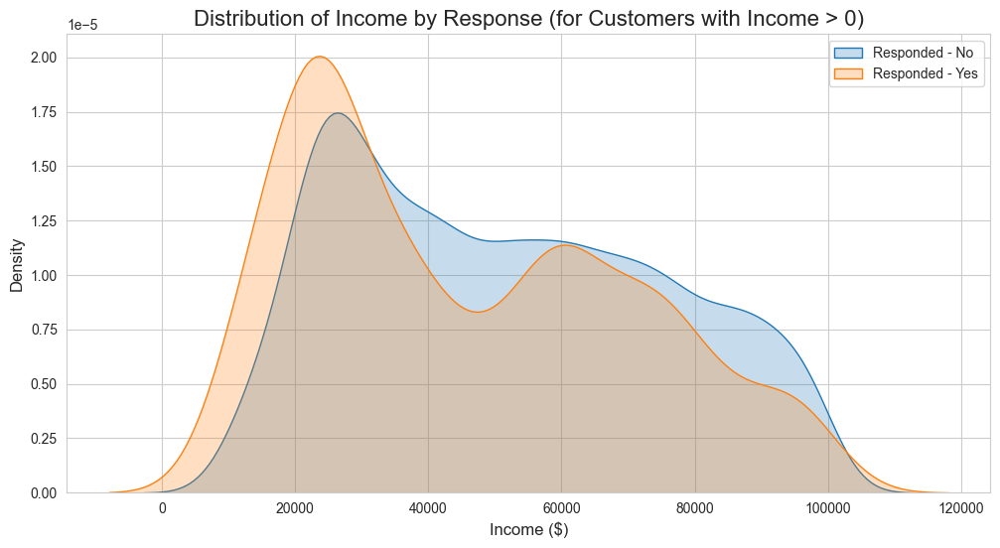
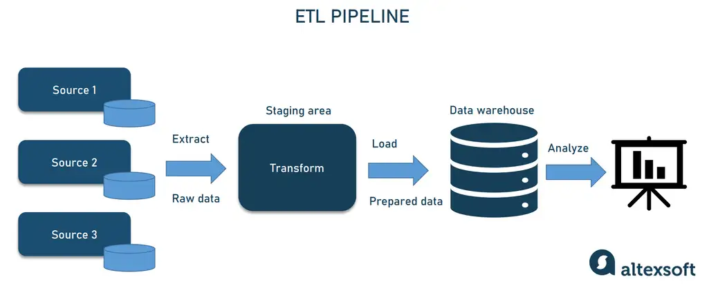
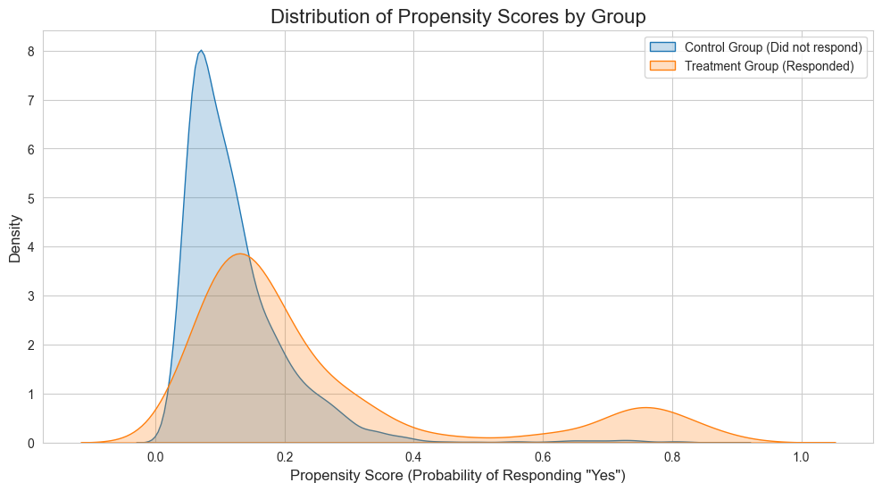

# Causal Inference for Marketing Strategy: Estimating the True Impact of a Campaign

### *Project by Peter Osipchuk*

---

## 1. The Business Problem: A Common Marketing Dilemma

Imagine we are data analysts at an insurance company. The marketing team has just finished a new campaign designed to increase customer engagement and, ultimately, customer value. They come to us with a simple but crucial question: **"Was the campaign worth it? What was its real impact?"**

### The Obvious (But Flawed) First Step

The most straightforward approach is to divide our customers into two groups: those who responded to the campaign ("Responders") and those who did not ("Non-Responders"). We can then compare the average value (in our case, the `Total Claim Amount`) of these two groups.

*A simple comparison between the two groups seems like the logical first step.*

When we do this with the **IBM Watson Marketing Customer Value Dataset**, we find that the Responders have an average claim amount that is only **$14.00 higher** than the Non-Responders. Based on this, we might conclude the campaign had a tiny, almost negligible, effect.

### The Hidden Trap: Selection Bias

This simple comparison leads us to a dangerous trap. Before we can trust this result, we have to ask a critical question:

> **Were these two groups of customers similar to begin with?**

The answer is almost certainly **no**. The marketing team likely didn't target customers at random. They probably "cherry-picked" customers they believed were already more engaged, had premium policies, or higher incomes. This is called **selection bias**.

*The reality is that the "Responders" group was likely a biased sample from the start.*

This creates a massive problem for our analysis. We can't tell if the difference in claim amounts is due to the campaign itself or simply because the two groups were fundamentally different from the very beginning. Comparing these two groups is like comparing apples and oranges.

### This Project's Goal

This project's core mission is to solve this problem. We will use techniques from **Causal Inference** to correct for this selection bias. Our goal is to simulate a randomized A/B test after the fact, allowing us to isolate the **true causal effect** of the marketing campaign on customer value. By doing this, we can provide a reliable, data-driven answer that the business can use to make informed strategic decisions.

## 2. Framing the Causal Question

To find the *true* impact of the marketing campaign, we can't just compare the group of responders to the group of non-responders. That approach is flawed by the selection bias we identified earlier.

Instead, we need to ask a much more precise "what if" question for each customer.

### The Power of the "What If" (The Counterfactual)

Imagine a single customer who responded to our campaign. We know their total claim amount—it's in our data. But to know the campaign's effect, we need to know what her claim amount *would have been* if she **had not** responded to the campaign.

This unobserved "what if" scenario is called a **counterfactual**. The difference between what actually happened (the factual) and what would have happened in this alternate reality (the counterfactual) is the true **causal effect**.

*A causal effect is the difference between an actual outcome and its unobserved counterfactual.*

Of course, we can never observe the counterfactual in reality. The entire goal of causal inference is to use data and statistical methods to intelligently **estimate** it.

### Our Analytical Framework

With this framework in mind, we can formally state our project's key question and define our core variables:

> **What is the causal effect of a customer responding to the marketing campaign (the "Treatment") on their `Total Claim Amount` (the "Outcome")?**

This leads us to define our analytical groups:
* **Treatment Group:** Customers who responded to the campaign (`Response` = 'Yes').
* **Control Group:** Customers who did not respond (`Response` = 'No').
* **Outcome Variable:** The continuous, numerical value `Total Claim Amount`.

By estimating this effect, we can move beyond simple correlations and build a trustworthy foundation for calculating the campaign's true Return on Investment (ROI).
## 3. The Challenge: Uncovering a Hidden Bias

With our causal question framed, the analytical journey begins. But right away, we encounter a critical roadblock that lies at the heart of this project.

### The Initial (and Misleading) Finding

The first step in our analysis was to perform a simple comparison of the average `Total Claim Amount` between the customers who responded to the campaign and those who did not.

| Group | Average Total Claim Amount |
| :--- | :--- |
| **Responders (Yes)** | $446.08 |
| **Non-Responders (No)**| $432.08 |
| **Difference** | **+$14.00** |

The result was a small difference of only **$14.00**, which was also found to be statistically insignificant.

> **The easy conclusion?** The campaign had no real impact, and the project ends here. However, we are going to dig deeper.

### The Detective Work: Are the Groups Truly Alike?

The validity of the +$14.00 figure depends entirely on the assumption that the "Responders" and "Non-Responders" are similar in every other way. We decided to test this assumption by comparing their underlying characteristics. This is where we found the smoking gun.


*This plot of customer income by response group was our key piece of evidence. It clearly shows a systematic difference—the customers who responded had a noticeably different income profile than those who did not.*

This plot proves that **we are not comparing like with like**. The group of customers who responded to the campaign was fundamentally different from the group that didn't, a classic case of **selection bias**.

### The Core Problem Explained: Confounding

This selection bias creates a statistical problem known as **confounding**. A confounding variable is a pre-existing attribute that influences both the treatment and the outcome, creating a false or distorted relationship between them.

In our case, **Income** is a clear confounder:
* It influences the **Likelihood to Respond** to the campaign (the Treatment).
* It also influences the **Total Claim Amount** (the Outcome).

*Income acts as a confounder, making it impossible to isolate the true effect of the campaign through simple comparison.*

### The Path Forward: Our Mission

Because of this confounding, our initial +$14.00 finding is unreliable. Our mission is to use causal inference techniques—specifically **Propensity Score Matching**—to statistically control for these pre-existing differences. This allows us to simulate the A/B test the company should have run, creating a fair, "apples-to-apples" comparison to find the campaign's true, unconfounded impact.

## 4. Our Analytical Approach: A Step-by-Step Journey

To solve the challenge of selection bias and uncover the true causal effect, we followed a rigorous three-phase analytical process.

### Phase 1: Laying the Groundwork — Data Preparation

Before any analysis could begin, we first had to create a clean, standardized, and model-ready dataset. This is the essential *mise en place* of any data science project.

* **Standardization:** We began by cleaning and standardizing all column names (e.g., `Customer Lifetime Value` became `customer_lifetime_value`) and converting date columns into a usable `datetime` format.
* **Defining Core Variables:** We engineered our key `treatment` variable by converting the 'Yes'/'No' responses into a binary format (`1` for Treated, `0` for Control). This is necessary because statistical models require numerical inputs.
* **Preparing for the Model:** To use our customer attributes to control for bias, we had to prepare them for our machine learning model. This involved two key steps:
    1.  **One-Hot Encoding:** Converted all categorical features (like `Coverage` or `Education`) into numerical dummy variables.
    2.  **Feature Scaling:** Standardized all numerical features (like `Income` and `CLV`) using `StandardScaler`. This ensures that features with large values don't unfairly dominate the model's learning process.


*Our data preparation pipeline ensured a clean and robust dataset for analysis.*

### Phase 2: The Investigation — Exploratory Data Analysis (EDA)

This is where we played detective. The goal of our EDA was to test the hypothesis that the Treatment and Control groups were fundamentally different. We visualized the distributions of key customer characteristics between the two groups, and our investigation confirmed our suspicions.


*This plot of customer income was our "smoking gun," providing clear visual proof of selection bias.*

### Phase 3: The Solution — Causal Inference with Propensity Score Matching (PSM)

Since a simple comparison was invalid, we turned to Propensity Score Matching (PSM) to statistically create the fair comparison group we lacked. The process involved three key steps:

**1. Predict (Calculating the Propensity Score)**
We first trained a logistic regression model. Its job was to learn what a "typical" campaign responder looks like based on all their pre-existing characteristics. The model then assigned every single customer in our dataset a **propensity score**—a probability (from 0 to 1) of them responding to the campaign.

**2. Check (Verifying Common Support)**
This is a crucial quality check. For matching to work, there must be non-responders who are similar to our responders. We plotted the propensity scores of both groups and confirmed a healthy region of overlap, or **common support**. This gave us the green light to proceed.


*This plot confirms that there are comparable individuals in both groups, making our matching approach valid.*

**3. Match & Compare (Finding the "Digital Twins")**
Finally, we performed the matching. For every customer in our Treatment group, we searched the entire Control group to find the individual with the most similar propensity score. By comparing the `Total Claim Amount` of only these carefully matched pairs, or "digital twins," we were able to isolate and estimate the campaign's true, unbiased effect.

## 5. Results & Key Findings

After applying the Propensity Score Matching methodology, the results revealed a story that was dramatically different from our initial, naive comparison.

### Comparing the Results: Naive vs. Causal

The visual below summarizes our journey. We started with a small, positive, and insignificant result. After correcting for bias, we ended with a nuanced causal insight that points to a major strategic opportunity.


*This chart contrasts the initial misleading estimate with the final, more reliable causal estimates (ATT and ATE).*

The hard numbers behind this chart are summarized in the table below:

| Metric | Estimate | P-value | Conclusion |
| :--- | :--- | :--- | :--- |
| **Naive Difference** | +$14.00 | > 0.05 | Not Significant |
| **Causal Effect on Responders (ATT)** | **-$4.83** | **0.701** | **Not Statistically Significant** |
| **Causal Effect on Population (ATE)** | **-$20.23** | **0.001** | **Statistically Significant** |

### The Primary Finding (ATT): No Impact on the Target Audience

The **ATT (Average Treatment Effect on the Treated)** is the most direct answer to our business question about this campaign's performance. It isolates the effect *only on the group of customers who actually responded*.

> Our model found the ATT to be **-$4.83** with a p-value of **0.701**. In plain English, this means the campaign had **no statistically significant effect** on the claim behavior of the people it successfully reached. The small estimated decrease is likely due to random chance.

### The Deeper Insight (ATE): A Story of Missed Opportunity

The most interesting result is the **ATE (Average Treatment Effect)**. This metric estimates what the effect would have been if *every customer* in our dataset had responded to the campaign.

> Here, the model found a statistically significant effect of **-$20.23** (p = 0.001). This is a powerful insight. It suggests that the marketing campaign itself **is actually effective at reducing claim costs**, but it fundamentally failed to appeal to the right audience—the very customers it would have impacted the most.

This finding shifts the narrative from "the campaign was a failure" to "the campaign was poorly targeted."

## 6. Conclusion & Business Recommendation

This project set out to find the true financial impact of a marketing campaign, moving beyond a flawed, surface-level analysis. By applying a rigorous causal inference methodology, we uncovered a nuanced story with significant strategic implications.

### Final Conclusion

The initial naive analysis, which showed a negligible +$14.00 difference in claim amounts, was proven to be misleading due to significant selection bias in the customer groups.

After controlling for these biases with Propensity Score Matching, our analysis revealed two key findings:
1.  **On the Target Audience (ATT):** The campaign had **no statistically significant effect** on the customers it successfully reached. The estimated impact was a negligible -$4.83 (p = 0.701).
2.  **On the Broader Population (ATE):** The campaign itself appears to be effective in principle, demonstrating a statistically significant potential to **reduce claim amounts by $20.23** (p = 0.001) if it were applied to the average customer.

> **The key takeaway is that the campaign's message is potentially valuable, but it was delivered to the wrong audience.** The lack of impact on responders (ATT) combined with the strong potential impact on the general population (ATE) points to a fundamental mismatch between the campaign's creative/offer and the segment of customers it needs to influence.

### Actionable Business Recommendation

Based on this causal analysis, the following recommendations are proposed to the marketing and strategy teams:

* **1. Do Not Scale the Current Campaign:** Given the lack of a statistically significant impact on the target audience (the ATT), the campaign in its current form does not demonstrate a positive ROI and should not be scaled.

* **2. Investigate the High-Potential Segment:** The significant ATE finding is a valuable piece of market intelligence. A follow-up analysis should be conducted to profile the customers who had high propensity scores but did not respond. Understanding this "missed opportunity" segment is key to unlocking future growth.

* **3. Design and A/B Test a New Campaign:** Armed with insights about the high-potential segment, the marketing team should develop a new campaign with creative and offers specifically designed to resonate with them. This new campaign should be deployed as a proper randomized control trial (A/B test) to validate our model's findings and accurately measure its ROI.

## 7. Technical Stack

This project was conducted entirely in Python and utilized the following core libraries for data science and analysis:

-   **Data Manipulation & Analysis:** `pandas`, `scikit-learn`
-   **Causal Inference:** `causalinference`
-   **Data Visualization:** `matplotlib`, `seaborn`
-   **Development Environment:** `Jupyter Notebook`


## 8. How to Run This Project

To replicate this analysis, please follow the steps below.

**Prerequisites:**
- Python 3.8+
- Git

**Steps:**
1.  **Clone the Repository**
    Open your terminal or command prompt and clone this repository to your local machine:
    ```bash
    git clone [https://github.com/YourUsername/causal-marketing-analysis.git](https://github.com/YourUsername/causal-marketing-analysis.git)
    cd causal-marketing-analysis
    ```

2.  **Create a Virtual Environment**
    It is a best practice to create a virtual environment to manage project dependencies.
    ```bash
    # For Mac/Linux
    python3 -m venv venv
    source venv/bin/activate

    # For Windows
    python -m venv venv
    .\venv\Scripts\activate
    ```

3.  **Install Required Libraries**
    Install all the necessary libraries using the `requirements.txt` file.
    ```bash
    pip install -r requirements.txt
    ```

4.  **Download the Dataset**
    The dataset for this project must be downloaded from Kaggle.
    -   **Link:** [IBM Watson Marketing Customer Value Data](https://www.kaggle.com/datasets/pankajbhowmik/ibm-watson-marketing-customer-value-data)
    -   Place the downloaded `WA_Fn-UseC_-Marketing-Customer-Value-Analysis.csv` file into the `/data` directory within this project.

5.  **Run the Analysis**
    Launch the Jupyter Notebook to explore the project.
    ```bash
    jupyter notebook
    ```
    Navigate to the `/notebooks` directory and open the `01-EDA-and-Problem-Framing.ipynb` file. You can then run the cells sequentially to see the full analysis.